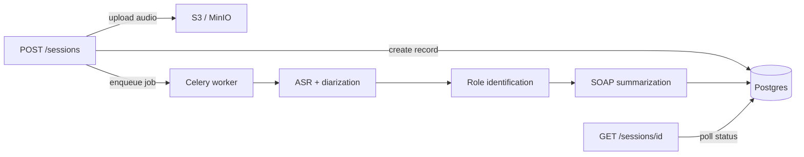

# ConvoScribe

ConvoScribe ingests audio recordings of doctor–patient conversations and produces structured, role-labeled clinical summaries (SOAP notes).

## Architecture

ConvoScribe turns a clinical audio recording into a structured SOAP note through a multi-stage AI pipeline. **Create Session** is the entry point: it accepts the audio, stores it securely, and starts background processing. It does **not** return the transcript or summary in the same response — poll **Get Session** until `status` is `completed`.

### Pipeline stages

| Stage | What it does | Technology (production) |
|-------|--------------|-------------------------|
| **1. ASR** | Converts speech to raw text | faster-whisper (transformer-based, multi-accent) |
| **2. Speaker diarization** | Segments audio and labels who spoke when (`SPEAKER_00`, `SPEAKER_01`, …) | pyannote |
| **3. Role identification** | Maps speakers to clinician, patient, or other (e.g. family) | GPT (`ROLE_ID_MODEL`) |
| **4. Clinical summarization** | Synthesizes a structured SOAP note from the labeled transcript | GPT (`SUMMARY_MODEL`) |

**NLP / entity extraction:** ConvoScribe does not run a separate Named Entity Recognition (NER) service. Symptoms, medications, dosages, and diagnoses are extracted during the LLM summarization step as part of the SOAP output. A dedicated NER stage could be added later for coding, billing, or FHIR export.

### Request flow



1. **Create Session** (`POST /api/v1/sessions`) — validate audio, upload to object storage, create a `pending` session, enqueue the pipeline. Returns `202 Accepted` with `session_id` immediately.
2. **Background worker** — runs ASR → diarization → role ID → summarization. If role confidence is low, status becomes `needs_review` and summarization waits until roles are corrected.
3. **Get Session** (`GET /api/v1/sessions/{id}`) — returns status, diarized transcript, role map, and SOAP summary when ready.
4. **Update Roles** (`PATCH /api/v1/sessions/{id}/roles`) — optional correction of doctor/patient labels; triggers re-summarization.
5. **Approve Session** (`POST /api/v1/sessions/{id}/approve`) — clinician sign-off on the final note.

### Endpoint roles

| Endpoint | Role in the pipeline |
|----------|----------------------|
| `POST /sessions` | **Start** — upload audio, receive `session_id` |
| `POST /analyze` | **One-shot** — upload audio, get transcript + roles + SOAP in one response (no session) |
| `GET /sessions/{id}` | **Retrieve** — status, transcript, roles, SOAP summary |
| `GET /sessions/{id}/transcript` | **ASR + diarization output** only |
| `PATCH /sessions/{id}/roles` | **Correct** speaker labels, re-run summarization |
| `POST /sessions/{id}/approve` | **Sign off** on the completed note |

ASR and diarization can take seconds to minutes, so processing is asynchronous. The Celery worker must be running for uploads to complete beyond `pending`.

## Project structure

```
ConvoScribe/
├── main.py                 # FastAPI entrypoint
├── app/
│   ├── api/routes.py       # /api/v1 endpoints
│   ├── ai/                 # OpenAI client, prompts, role ID, summarization
│   ├── core/               # config, auth, logging
│   ├── db/                 # SQLAlchemy models and session
│   ├── jobs/               # Celery pipeline + retention cleanup
│   ├── models/schemas.py   # Pydantic request/response models
│   ├── services/           # session lifecycle, audit logging
│   ├── storage/            # S3-compatible object storage
│   └── transcription/      # TranscriptionService interface + backends
├── tests/
├── postman/
│   └── ConvoScribe.postman_collection.json
├── docker-compose.yml
├── Dockerfile
├── Procfile
└── deploy.sh
```

## Quick start (Docker)

```bash
cp .env.example .env
# Set API_KEY and OPENAI_API_KEY for production
docker compose up --build
```

Service runs on **port 8026**.

```bash
curl -X POST http://localhost:8026/api/v1/analyze \
  -H "X-API-Key: change-me-to-a-secure-random-key" \
  -H "X-Clinician-Id: dr-smith" \
  -F "audio=@samples/visit_sample.wav"

curl -X POST http://localhost:8026/api/v1/sessions \
  -H "X-API-Key: change-me-to-a-secure-random-key" \
  -H "X-Clinician-Id: dr-smith" \
  -F "patient_id=patient-001" \
  -F "audio=@sample.wav"

curl http://localhost:8026/api/v1/sessions/{session_id} \
  -H "X-API-Key: change-me-to-a-secure-random-key" \
  -H "X-Clinician-Id: dr-smith"
```

Docker Compose defaults to `TRANSCRIPTION_BACKEND=stub` and `USE_LLM_STUB=true` for offline development.

## Postman collection

Import [`postman/ConvoScribe.postman_collection.json`](postman/ConvoScribe.postman_collection.json) into Postman.

Collection variables (edit before running):

| Variable | Default | Description |
|----------|---------|-------------|
| `baseUrl` | `http://localhost:8026` | API base URL |
| `apiKey` | — | Value for `X-API-Key` header |
| `clinicianId` | `dr-smith` | Value for `X-Clinician-Id` header |
| `patientId` | `patient-001` | Patient ID for uploads |
| `sessionId` | _(auto-set)_ | Saved after **Create Session** |

**Suggested flow (async):** Health Check → Create Session (attach `samples/visit_sample.wav`) → Get Session (poll until `completed`) → Get Transcript → Approve Session. Use **Update Roles** if `needs_review` is `true`.

**Suggested flow (one-shot):** Health Check → **Analyze Audio** (attach `samples/visit_sample.wav`) — returns transcript, roles, and SOAP in a single response.

For a JSON body instead of a file upload, use **Analyze Audio (Raw JSON) — 3 minute visit**. That request already contains `audio_base64` for `samples/visit_3min_sample.wav`. Re-import the collection after regenerating the sample (`py scripts/generate_sample_audio.py`, which also runs `py scripts/embed_3min_base64_postman.py`). The collection file is large because it embeds the full visit.

### Sample audio

Ready-made visit recordings:

| File | What it contains |
|------|------------------|
| [`samples/visit_sample.wav`](samples/visit_sample.wav) | Sequential two-speaker visit (doctor, patient) |
| [`samples/visit_overlap_sample.wav`](samples/visit_overlap_sample.wav) | Three-speaker chest-pain visit with overlapping talk (doctor, patient, family) |
| [`samples/visit_3min_sample.wav`](samples/visit_3min_sample.wav) | GP visit (≤3 min): note summary, vitals, and measurements for EMR forms. Script: [`samples/visit_3min_sample.txt`](samples/visit_3min_sample.txt) |

Regenerate both anytime:

```bash
py scripts/generate_sample_audio.py
```

Use the overlap sample to stress ASR, diarization, and role identification:

```bash
curl -X POST http://localhost:8026/api/v1/analyze \
  -H "X-API-Key: change-me-to-a-secure-random-key" \
  -H "X-Clinician-Id: dr-smith" \
  -F "audio=@samples/visit_overlap_sample.wav"
```

## Local development

**Option A — API on host, infra in Docker (recommended for dev)**

```bash
# Terminal 1: start Postgres, Redis, MinIO only
docker compose up postgres redis minio -d

# Terminal 2: API (use localhost URLs in .env — see .env.example)
py main.py

# Terminal 3: background worker (required for transcription pipeline)
celery -A app.jobs.celery_app.celery_app worker --loglevel=info
```

Your `.env` must use `localhost` hostnames (`localhost:5433`, `localhost:6380`, `localhost:9000`), not Docker service names like `postgres` or `redis`. Those only resolve inside the Compose network.

**Option B — everything in Docker**

```bash
docker compose up --build
```

Use the commented Docker hostnames in `.env.example` (`postgres`, `redis`, `minio`) when running the API container via Compose.

**Option C — fully local without Docker**

```bash
python -m venv .venv
.venv\Scripts\activate        # Windows
pip install -r requirements.txt
cp .env.example .env

uvicorn main:app --reload --port 8026
celery -A app.jobs.celery_app.celery_app worker --loglevel=info
celery -A app.jobs.celery_app.celery_app beat --loglevel=info
```

## API endpoints

| Method | Path | Description |
|--------|------|-------------|
| `POST` | `/api/v1/analyze` | Upload audio, run full pipeline synchronously |
| `POST` | `/api/v1/sessions` | Upload audio, start async pipeline |
| `GET` | `/api/v1/sessions/{id}` | Status, transcript, summary |
| `GET` | `/api/v1/sessions/{id}/transcript` | Diarized transcript only |
| `PATCH` | `/api/v1/sessions/{id}/roles` | Correct role mapping, re-summarize |
| `POST` | `/api/v1/sessions/{id}/approve` | Clinician approval |
| `GET` | `/api/v1/health` | Health check |

## Environment variables

See [`.env.example`](.env.example). Key settings:

| Variable | Description |
|----------|-------------|
| `OPENAI_API_KEY` | OpenAI API key |
| `OPENAI_BASE_URL` | Optional proxy/base URL |
| `ROLE_ID_MODEL` / `SUMMARY_MODEL` | GPT models (default `gpt-4o`) |
| `API_PORT` | Server port (default `8026`) |
| `USE_LLM_STUB` | Offline rule-based LLM placeholders |

## Testing

```bash
python -m pytest
```
